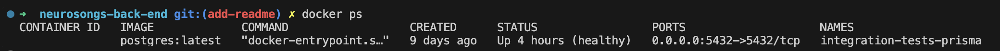

# Neurosongs Back-end API

This is the back-end server for the Neurosongs website, also created by me. It aims to be a mix between YouTube, Spotify, and a hint of Metacritic, taking the streaming capabilities of Spotify, the community aspect of YouTube, and the rating system from Metacritic.

## Cloning

To clone the project, set the terminal to your chosen directory, then run:

    git clone https://github.com/AlexMan123456/neurosongs-back-end

Then navigate into the directory:

    cd neurosongs-back-end

Install all required dependencies using:

    npm install

A list of all dependencies and their required versions can be found in the `package.json` file.

## Setting up Environment Variables

Create two environment variables, `.env.test` and `.env.development`. Put your test `DATABASE_URL` in `.env.test` and your development `DATABASE_URL` in `.env.development`, like so:

    DATABASE_URL=your_database_url

The database in both cases are managed with Prisma, so I would recommend setting both up using a Prisma database: https://www.prisma.io/postgres

`.env.development` also requires one more environment variable - the `PORT`. This is the port the server will be listening for requests on if provided. If not provided, it defaults to 8080. If you want to use a different port, add something like this to `.env.development`:

    PORT=your_chosen_port

## Firebase App Checking

Some endpoints are protected with Firebase to ensure that requests are coming from the front-end for Neurosongs to prevent people from using this API to mess with the data in an unintended way. All POST, PATCH, and DELETE requests are protected so that only the front-end app can make changes to the database.

You do not need to set this up for the test environment. For that, all you need to do is set the `FIREBASE_TEST_HEADER` environment variable in `.env,test` to be anything you want, and as long as you're also setting this as the header in the test file (which I'm already doing), the tests should still work.

However, if you want to run this API in development mode, you will need a Firebase project to connect to. To do this, you will first need to create a Firebase Admin service account. You can do this by going to the Firebase console, selecting your project, then go to Project Settings, then Users and permissions, then Service accounts. There should be a button that allows you to generate a new private key. This will download a JSON file for you. Now set all the properties given in that file in your `.env.development` file, formatting them in the following way:

    FIREBASE_ADMIN_TYPE=type
    FIREBASE_ADMIN_PROJECT_ID=project_id
    FIREBASE_ADMIN_PRIVATE_KEY_ID=private_key_id
    FIREBASE_ADMIN_PRIVATE_KEY=private_key
    ...

Assuming you've also set up the front-end in the intended way, it should now work as expected. To find out how to set up the front-end for app checking, see the corresponding  [App Checking section of the `README.md` in the front-end repository](https://github.com/AlexMan123456/neurosongs-front-end?tab=readme-ov-file#app-checking)

## Seeding Databases

Test database seeding is done automatically when running the server tests. The database is re-seeded after every test to ensure data doesn't persist between tests.

To seed the development database, run the following:
    
    npm run seed-dev

## Running the tests

To run the tests, you will first need to set up Docker. Install Docker and Docker Compose using [this link](https://docs.docker.com/get-started/get-docker/).

After that, run the following command:

    docker compose up -d

Check that your Docker container is running using docker ps. Your terminal should look something like this:

If this succeeds, now run the following command:

    npm test server

If you've set up your environment variables and Docker environment correctly, all tests should be passing. Make sure they are still passing if you decide to make any pull requests - I will be checking!

## Links

Link to front-end repository: https://github.com/AlexMan123456/neurosongs-front-end

Link to hosted version of the site: https://neurosongs.net
